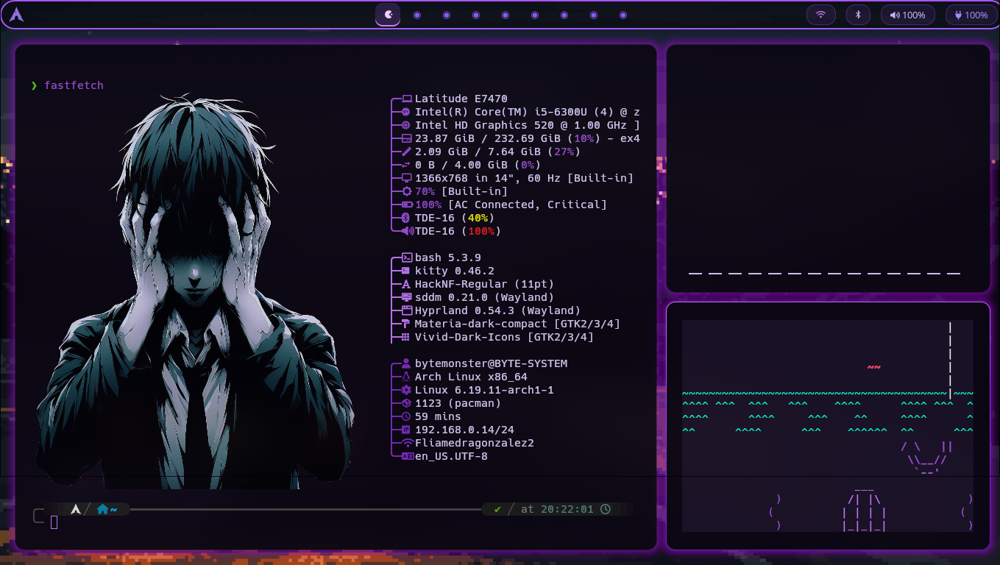
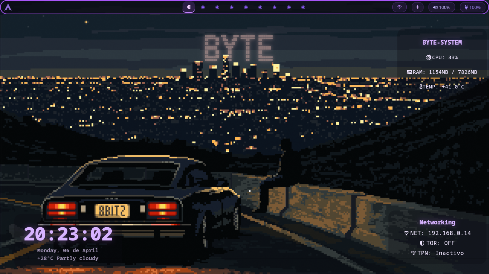

<h1 align="center">CyberByting Hyprland Dotfiles</h1>

Cyber purple setup for Hyprland, inspired by hacker aesthetics on Arch Linux.

<table>
  <tr>
    <td>
      
    </td>
    <td>
      
    </td>
    <td>
      
    </td>
  </tr>
</table>

<h2>Includes:</h2>

<ul>
  <li>Hyprland</li>
  <li>Eww</li>
  <li>WayBar</li>
  <li>Wofi</li>
  <li>Clickhist</li>
  <li>Kitty</li>
  <li>HyprIdle</li>
  <li>HyprLock</li>
  <li>HyprPaper</li>
  <li>HyprShot</li>
  <li>Clickhist</li>
  <li>Kitty</li>
</ul>
